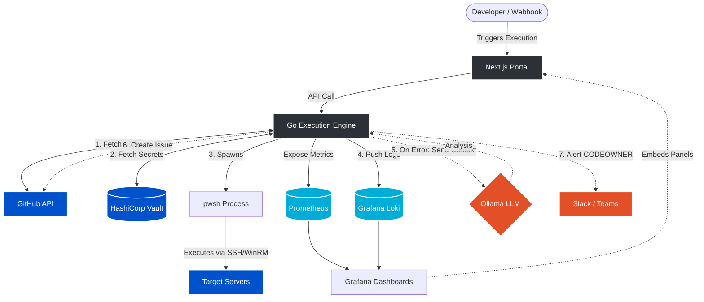

# CogniShell: AI-Augmented Centralized PowerShell Automation

[](LICENSE)
[](backend/go.mod)
[](frontend/package.json)
[](CONTRIBUTING.md)

CogniShell is a secure, centralized, and AI-augmented coordination engine designed to modernize enterprise PowerShell automation. By bridging version control (GitHub), secrets management (HashiCorp Vault), telemetry (Prometheus & Grafana Loki), and local LLMs (Ollama), CogniShell transitions administrative scripting from scattered execution to a secure GitOps model.

---

## 1. Problem & Solution

| Traditional PowerShell Executions | The CogniShell Solution |
| :--- | :--- |
| **Scattered Execution**: Scripts run on local workstations or individual task schedulers with zero audit trail. | **Centralized Engine**: Run scripts via a stateless Go API controller or Next.js developer console. |
| **Credential Sprawl**: Secrets and passwords hardcoded directly in script bodies or text configuration files. | **Zero-Trust Injection**: Functional IDs fetched dynamically from HashiCorp Vault at runtime and injected in-memory. |
| **Silent Failures & Manual Triage**: Failed runs go unnoticed, requiring manual log digging to find the root cause. | **AI Self-Healing**: Local Ollama LLM analyzes failed stderr, opens GitHub issues, and alerts developers. |
| **No Consolidated Logs**: Standard output and errors are lost or scattered across local file systems. | **Stream Telemetry**: Logs streamed in real-time to Grafana Loki; metrics aggregated by Prometheus. |

---

## 2. Core Capabilities

* **GitOps Execution**: Fetch `.ps1` automation code dynamically from GitHub branches into memory at runtime. Scripts are never stored on execution host disks.
* **Zero-Trust secrets**: Backend authenticates via Vault AppRole at runtime, retrieves functional credentials, and injects them as secure environment variables scoped strictly to the child `pwsh` process.
* **AI Incident Diagnostics**: Script failures trigger the local Ollama LLM (e.g., CodeLlama). The LLM performs root-cause analysis, suggests a fix, opens a GitHub issue, and assigns the CODEOWNER.
* **Telemetry & ChatOps**: live-stream stdout/stderr logs to Grafana Loki, record execution counts and durations in Prometheus, and dispatch incident notifications to Slack/Teams channels.
* **Developer Web Console**: Next.js UI showcasing the version-controlled script catalog, rendering Markdown documentation, displaying success/failure stats, and providing execution triggers.

---

## 3. High-Level Architecture



---

## 4. Quick Start

Get a local development cluster running in under 5 minutes.

### 1. Spin Up Infrastructure
Run the containerized Vault, Postgres, Prometheus, Loki, Grafana, and Ollama services:
```bash
docker compose up -d
```

### 2. Configure Your Environment
Create your `.env` configuration file from the template:
```bash
cp .env.example .env
```
Fill out the variables in `.env` (including GitHub tokens and Vault AppRole credentials. See the [Developer Guide](docs/developer-guide.md) for Vault initialization commands).

### 3. Run the Go Backend
```bash
cd backend
go run main.go
```

### 4. Run the Next.js Frontend Console
```bash
cd frontend
npm install
npm run dev
```
Navigate to `http://localhost:3001` in your browser.

### 5. Trigger an Execution (Example)
```bash
curl -X POST http://localhost:8080/api/v1/execute \
  -H "Content-Type: application/json" \
  -d '{"script_path": "Test-HappyPath.ps1", "environment": "dev"}'
```

---

## 5. Detailed Documentation Directories

To learn more about setting up, scaling, and using the platform, refer to the guides below:

* 📘 **[Developer Guide](docs/developer-guide.md)**: Deep dive into codebase setup, architecture details, Vault seeding, and local networking.
* 🧪 **[Testing Guide](docs/testing.md)**: Details unit testing, linting, and step-by-step manual E2E validation scenarios.
* ⚙️ **[Deployment Guide](docs/deployment.md)**: Details standard Docker deployment, environment configuration checklists, and our **Enterprise HA scaling roadmap** (task queues, ephemeral Job executors, cloud database clustering).
* 🔌 **[API Reference](docs/api-reference.md)**: Reference manual for REST API payloads, JSON structures, error response schemas, and Prometheus telemetry metrics.

For community contribution, standards, and future plans:
* 🗺️ **[Product Roadmap](ROADMAP.md)**: Future plans, security hardening, and feature backlog for Phase 2 (MVP2).
* 🤝 **[Contributing Guide](CONTRIBUTING.md)**: Pull Request processes, branch naming formats, and coding guidelines.
* 📜 **[Code of Conduct](CODE_OF_CONDUCT.md)**: General standards of conduct for our developers and maintainers.
