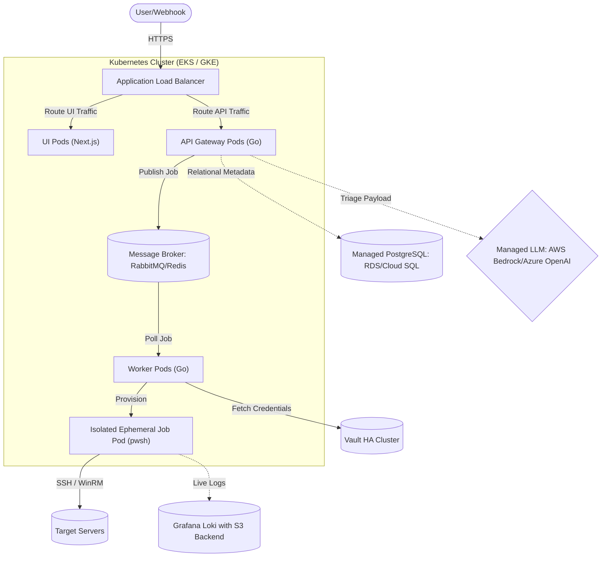

# Deployment Guide: CogniShell

This document outlines the deployment strategy, production requirements, security considerations, and the roadmap for scaling CogniShell into a highly available, enterprise-grade platform.

---

## 1. Traditional Containerized Deployment (Docker Compose)

For small-to-medium deployments or staging environments, CogniShell can be run entirely using Docker containers. The root [docker-compose.yml](../docker-compose.yml) configures both backend infrastructure and the application services.

To build and run the entire application tier (Go API and Next.js UI) alongside their database and logging dependencies, start the stack with the `app` profile:
```bash
docker compose --profile app up -d --build
```

### Productionizing Docker Compose
If running in a Docker Compose environment for production:
1. **Secrets Security**:
   * Do not store production secrets in the `.env` file.
   * Use Docker secrets or set environment variables in the host environment.
   * Ensure Vault is running in **production mode** (remove `VAULT_DEV_ROOT_TOKEN_ID` and initialize it with proper Shamir keys/unseal shares).
2. **Persistent Storage**:
   * Map database, Prometheus, and Grafana volumes to persistent, backed-up SAN or cloud storage directories, rather than ephemeral host volumes.
3. **Database Backups**:
   * Implement a cron job on the host machine to execute `pg_dump` on the PostgreSQL container and ship backups to secure object storage.

---

## 2. Enterprise Deployment (Target Architecture)

For high-availability, scalability, and absolute isolation, the architecture must transition from a single-host setup to a cloud-native orchestrated system.

### Recommended Infrastructure Diagram



---

## 3. Scaling & Architecture Details

### Decoupled Worker Queue Pattern
To scale script execution independently of API traffic and avoid CPU exhaustion on API gateway instances:
* **Implementation**: Deploy a distributed queueing framework like **Celery**, **Asynq**, or a message broker like **RabbitMQ** / **Amazon SQS**.
* **Flow**:
  1. The API Gateway receives the execution request, validates permissions, and pushes a task message containing `ScriptPath`, `Branch`, and `Environment` metadata into the queue.
  2. The API immediately returns a `202 Accepted` status with an Execution ID to the client.
  3. A pool of stateless **Go Workers** scale horizontally based on the queue depth. A worker claims a task, fetches the script/secrets, and executes it.
  4. The client polls a status endpoint or registers a webhook URL to receive notifications when execution finishes.

### Ephemeral Runner Sandboxes (Security Isolation)
Running arbitrary scripts in the same container space as application logic exposes Vault configuration details and API server service tokens.
* **Kubernetes Jobs**: Workers command the Kubernetes API to spawn a short-lived **Job Pod** running a hardened PowerShell base image.
* **Parameters**: The Vault secrets and fetched script code are injected into this specific Job Pod at startup.
* **Completion**: Once execution exits, the Job Pod is automatically garbage-collected. No data remains on disk.

### Infrastructure Scaling
* **Database (PostgreSQL)**: Use managed databases (e.g., AWS RDS PostgreSQL) with Multi-AZ deployment. Set up connection pooling (using PgBouncer) to prevent database resource exhaustion.
* **Log Storage (Loki)**: Loki should be configured in microservices mode, storing raw logs in durable object storage (e.g., AWS S3 or Google Cloud Storage) with a 30-day lifecycle expiration rule.
* **LLM Engine**: For production workloads, transition Ollama away from local CPU execution to:
  * Dedicated GPU node pools (e.g., AWS EKS node groups with NVIDIA T4/A10G instances) running **vLLM**.
  * Managed cloud APIs such as **AWS Bedrock (Claude)** or **Azure OpenAI (GPT-4)**.

---

## 4. Production Environment Configuration Checklist

Configure the following variables in your orchestration environment (Helm charts, Kubernetes manifests, or ECS task definitions):

| Category | Variable Name | Recommended Production Value | Description |
| :--- | :--- | :--- | :--- |
| **System** | `ENVIRONMENT` | `production` | Enables production error handling, security policies, and optimal caching. |
| | `APP_PORT` | `443` (via SSL/TLS proxy) | Port for API Gateway. |
| **Vault** | `VAULT_ADDR` | `https://vault.internal.net` | Point to the internal highly-available Vault cluster. |
| | `VAULT_SECRET_PATH` | `secret/data/cognishell/prod` | Target operational credentials path. |
| **PostgreSQL**| `DB_HOST` | `postgres-db.cluster-xxxx.rds.amazonaws.com` | Managed PostgreSQL endpoint. |
| | `DB_SSLMODE` | `require` | Forces encrypted connections between Go engine and database. |
| **Purge** | `PURGE_INTERVAL` | `1h` (1 hour) | Run log cleaner once per hour. |
| | `RETENTION_PERIOD` | `720h` (30 days) | Retain metrics and execution logs for 30 days. |
| **Alerts** | `NOTIFICATION_PROVIDER` | `slack` or `teams` | Configure corporate ChatOps alerting channels. |
