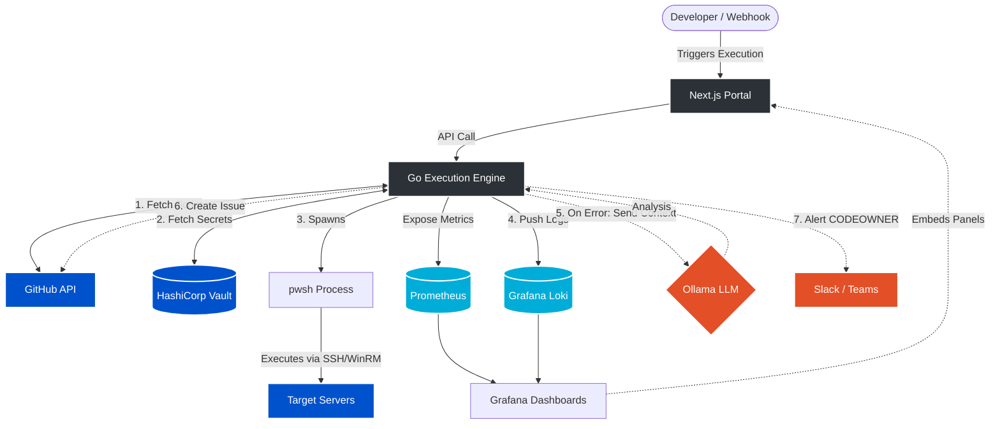

# Developer Guide: CogniShell

Welcome to the CogniShell Developer Guide. This document provides an architectural overview, local development environment setup instructions, and repository conventions.

---

## 1. Project Overview

CogniShell is an **AI-Augmented, Secure Centralized Automation Engine for PowerShell**. It acts as an intelligent coordinator between version control (GitHub), secrets management (HashiCorp Vault), observability stacks (Grafana, Loki, Prometheus, PostgreSQL), and self-hosted LLM triage engines (Ollama).

### The Problem Statement
In traditional enterprise environments, PowerShell automation is often plagued by:
* **Scattered Executions**: Scripts running locally from developer workstations or random task schedulers with zero centralized logging.
* **Credential Sprawl**: Secrets and credentials hardcoded in `.ps1` script bodies or stored insecurely in text files on execution hosts.
* **Manual Incident Triaging**: When a scheduled script fails, developers must manually dig through Event Viewer or text logs, leading to long Mean Time to Resolution (MTTR).
* **Audit and Compliance Gaps**: No unified record of who executed which script, with what arguments, when, and what the final output was.

### The Solution Approach
CogniShell addresses these challenges by moving execution to a centralized, secure coordinator model:
1. **GitOps-driven Execution**: Scripts are stored exclusively in Git repositories and pulled dynamically into memory at runtime (never written to disk).
2. **Zero-Trust Secrets**: Secrets are fetched dynamically from HashiCorp Vault at execution time and injected as secure environment variables scoped only to the child process.
3. **Unified Stream Logging**: Execution logs (stdout/stderr) are streamed directly to Grafana Loki for long-term retention and analysis.
4. **AI-powered Remediation**: Failed executions automatically trigger a self-hosted LLM via Ollama to analyze stderr, identify root causes, create GitHub issues, and alert code owners via Slack or MS Teams.

---

## 2. System Architecture

CogniShell operates as a stateless orchestrator. Below is the workflow diagram depicting execution request routing, secret retrieval, telemetry streams, and failure remediation.

### Architecture Diagram



### Component Breakdown
* **CogniShell UI (Next.js)**: A lightweight developer console. It displays the version-controlled script catalog, renders script documentation, allows triggering executions, and embeds Grafana dashboards for metrics and logs.
* **CogniShell Engine (Go)**: The stateless execution orchestrator that exposes the REST API, coordinates Vault authentication, fetches scripts from GitHub in-memory, spawns child shell runspaces (`pwsh`), and streams logs/metrics.
* **HashiCorp Vault**: Stores functional credentials for execution target servers.
* **Observability Stack (Prometheus, Loki, Grafana, PostgreSQL)**: Aggregates metrics (execution totals, durations) and streams stderr/stdout logs with a configurable TTL (e.g., 30 days).
* **Ollama (Self-Hosted LLM)**: Analyzes failed executions locally to provide context-aware, private bug analysis.
* **Integrations (GitHub & ChatOps)**: Automatically files remediation issues and pings CODEOWNERS via webhooks.

---

## 3. Directory Structure

The repository is structured as follows:

```
CogniShell/
├── docs/                     # Detailed guides and API definitions
│   ├── developer-guide.md    # Developer guide (this document)
│   ├── testing.md            # Testing guide and local E2E workflows
│   ├── deployment.md         # Production deployment considerations
│   └── api-reference.md      # API endpoint contracts and specifications
├── backend/                  # Go application (Execution Engine)
├── frontend/                 # Next.js web application (Developer Portal)
├── docker/                   # Configuration files for Loki, Grafana, and Prometheus
├── docker-compose.yml        # Development environment services setup
├── .env.example              # Template for environment configuration variables
├── README.md                 # Primary landing page
├── CONTRIBUTING.md           # Guidelines for code contributions
├── CODE_OF_CONDUCT.md        # Community standard of conduct
└── LICENSE                   # Project Open Source License
```

---

## 4. Local Development Setup

To run a full development stack locally:

### Prerequisites
1. **Go (1.20+)** installed on your workstation.
2. **Node.js (18+)** and `npm` installed.
3. **Docker** and **Docker Compose** installed (running natively or inside a VM).
4. **PowerShell Core (pwsh)** installed on the system executing the scripts (local host or container).

### Networking: The Windows + Multipass Context
If your development host is Windows and you run Docker containers inside a Multipass Ubuntu VM:
* **The Problem**: A Go application running inside a Docker container (or natively on Windows) cannot resolve native host services using `localhost` when bridging networks.
* **The Solution**: Identify your Windows host's primary LAN IP (run `ipconfig` in PowerShell) and use this IP instead of `localhost` in your configuration endpoints (e.g., `http://192.168.1.50:9090` for Prometheus).

---

### Step 1: Spin Up Infrastructure Services
Start the supporting databases and containers in the background:
```bash
# Run only infrastructure dependencies (recommended for local development)
docker compose up -d

# OR run the entire stack (including containerized backend and UI)
docker compose --profile app up -d --build
```
Verify that all services are healthy:
* Vault: `http://localhost:8200`
* Grafana: `http://localhost:3000` (credentials: `admin` / `admin`)
* Prometheus: `http://localhost:9090`
* Loki: `http://localhost:3100`
* Ollama: `http://localhost:11434`

---

### Step 2: Initialize HashiCorp Vault
Before testing, Vault must be seeded with AppRole authentication and target credentials:

1. **Log in to Vault CLI** (or use the web UI at `http://localhost:8200` with the root token `myroot` as defined in `docker-compose.yml`).
2. **Enable AppRole Auth**:
   ```bash
   vault auth enable approle
   ```
3. **Create access policy (`cognishell-policy.hcl`)**:
   ```hcl
   path "secret/data/cognishell/*" {
     capabilities = ["read"]
   }
   ```
4. **Write the policy to Vault**:
   ```bash
   vault policy write cognishell cognishell-policy.hcl
   ```
5. **Create the AppRole binding**:
   ```bash
   vault write auth/approle/role/cognishell-backend token_policies="cognishell" token_ttl=1h
   ```
6. **Fetch Role ID and Secret ID**:
   ```bash
   vault read auth/approle/role/cognishell-backend/role-id
   # Output: role_id (save this for .env)

   vault write -f auth/approle/role/cognishell-backend/secret-id
   # Output: secret_id (save this for .env)
   ```
7. **Seed a mock target secret**:
   ```bash
   vault kv put secret/data/cognishell/dev username="TestAdmin" password="SuperSecretPassword!"
   ```

---

### Step 3: Configure Environment Variables
1. Copy `.env.example` in the root folder to `.env`:
   ```bash
   cp .env.example .env
   ```
2. Open `.env` and fill in:
   * `VAULT_ROLE_ID` and `VAULT_SECRET_ID` retrieved in Step 2.
   * `GITHUB_TOKEN` (A GitHub Personal Access Token with access to read script repositories).
   * Update the endpoints to use your host's IP if executing inside a Multipass VM.

---

### Step 4: Run the Go Backend
1. Navigate to the `backend` directory:
   ```bash
   cd backend
   ```
2. Install dependencies and run the server:
   ```bash
   go mod download
   go run main.go
   ```
The backend server will run on `http://localhost:8080` (or `APP_PORT`).

---

### Step 5: Run the Next.js Frontend UI
1. Navigate to the `frontend` directory:
   ```bash
   cd frontend
   ```
2. Install dependencies:
   ```bash
   npm install
   ```
3. Run the development server:
   ```bash
   npm run dev
   ```
The dashboard portal will be accessible at `http://localhost:3001` (mapped to avoid conflicts with Grafana on port 3000).

---

## 5. Coding Conventions

* **Go (Backend)**:
  * Format all files using standard tooling (`go fmt ./...`).
  * Ensure context packages are used appropriately in HTTP request lifecycles.
  * Check and handle all errors explicitly.
* **Next.js (Frontend)**:
  * Adhere to TypeScript structures; avoid the use of `any` types.
  * Run `npm run lint` before committing to identify potential bugs.
* **Secrets Safety**:
  * Never commit `.env` or files containing plain-text keys to version control.
  * Always use Vault KV stores for runtime operational credentials.
